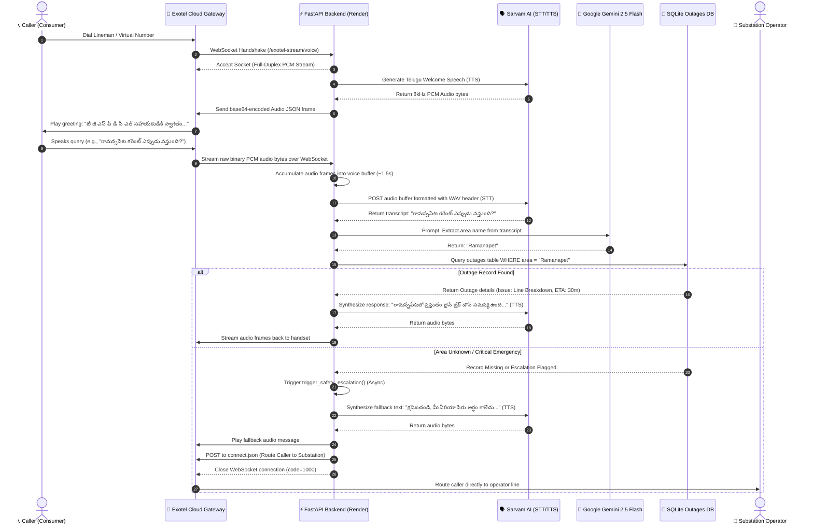

# ⚡ TGSPDCL AI Voice Call Assistant

[](https://fastapi.tiangolo.com)
[](https://www.python.org)
[](https://kotlinlang.org)
[](https://deepmind.google/technologies/gemini/)
[](https://www.sarvam.ai/)
[](https://exotel.com/)

👉 **GitHub Repository**: [https://github.com/svasidhar/lineman-ai-assistant](https://github.com/svasidhar/lineman-ai-assistant)

An AI-powered cloud telephony voice agent and background call-screening companion designed to assist TGSPDCL (Telangana State Southern Power Distribution Company Limited) linemen. The system automatically intercepts unknown consumer calls, interacts with callers in polite, regional Telugu, validates power outage queries against a live SQLite grid, and routes complex requests or emergencies to substation operators asynchronously.

---

## 🏗️ System Architecture & Workflow

The diagram below outlines the full-duplex speech and database lookup loops established between Exotel Telephony, Sarvam AI, Google Gemini, and the FastAPI application layer:



---

## 🔥 Key Technical Highlights

### ⚡ Asynchronous Voice Streaming Backend
* **Full-Duplex WebSocket Pipeline**: Mounts `/exotel-stream/voice` directly on FastAPI, handling real-time linear PCM audio frames.
* **Modern `google-genai` Async SDK**: Utilizes non-blocking async clients (`client.aio.models.generate_content`) to call **Gemini 2.5 Flash** for rapid location extraction in under 1 second.
* **Non-Blocking Safety Escalations**: Fallbacks and substation routing triggers use `httpx.AsyncClient` to prevent blocking the event loop and avoid carrier silence timeouts.
* **Robust Telemetry & Guards**: Telemetry tracking loggers track packet stream ingestion, and Starlette `RuntimeError` hooks gracefully handle abrupt carrier disconnects.
* **Regional Speech Integration**: Connects to Sarvam AI's `bulbul:v3` model (with TTS WAV container parsing and linear PCM header-stripping) and standard STT configurations.

### 📱 Android Lineman Companion Client (Kotlin & Compose)
* **Silent Interception Service**: Background BroadcastReceiver and foreground `CallScreeningService` capture incoming unknown calls, mute ringers automatically, and answer hands-free.
* **Audio Routing Manager**: Utilizes TelecomManager APIs to programmatically accept calls and routes audio dynamically into speakerphone/earpiece paths (`AudioDeviceInfo.TYPE_BUILTIN_SPEAKER`).
* **Bilingual UI Dashboard**: Sleek glassmorphic interface built with Jetpack Compose featuring real-time call logging logs, audio playback controllers, and manual override quick replies.

---

## 📂 Project Directory Structure

```plaintext
lineman-ai-assistant/
├── api/
│   ├── routes.py             # Core REST API endpoints (GET /incoming webhooks, auth, user queries)
│   ├── staff_routes.py       # Lineman voice update endpoints (Milestone 1)
│   └── websocket_handler.py  # Asynchronous Live WebSocket voicebot stream engine
├── config/
│   └── settings.py           # Environment variables configuration and startup key validation
├── models/
│   ├── database.py           # Thread-safe SQLite DatabaseManager (outages, memory, logs, settings)
│   └── nlp_model.py          # Rule-based fallback NLP classifiers & entity extractor triggers
├── static/
│   ├── app.js                # Frontend portal companion (simulates calls, lists logs, edits live grid)
│   ├── index.html            # Dashboard HTML portal
│   └── style.css             # Glassmorphic dashboard UI styling sheet
├── mobile/                   # Android Client (Kotlin, Gradle, Jetpack Compose)
├── main.py                   # Central FastAPI app instantiation and server startup node
├── requirements.txt          # Python ecosystem package dependencies
└── README.md                 # Project documentation
```

---

## 🛠️ Installation & Setup

### 1. Prerequisites
Ensure you have Python 3.10+ installed.

### 2. Install Dependencies
Clone the repository and install packages from the root directory:
```bash
pip install -r requirements.txt
```

### 3. Configure Credentials
Create a `.env` file in the root folder and define the required API keys (all telephony and AI keys are securely loaded on startup):
```env
GEMINI_API_KEY="your-google-gemini-api-key"
SARVAM_API_KEY="your-sarvam-ai-api-key"
OPENAI_API_KEY="your-openai-api-key"

DATABASE_URL="sqlite:///./outage_data.db"
LOG_LEVEL="INFO"

# Exotel Configuration
EXOTEL_ACCOUNT_SID="your-account-sid"
EXOTEL_API_KEY="your-api-key"
EXOTEL_API_TOKEN="your-api-token"
EXOTEL_EXOPHONE="your-exophone-number"
```

### 4. Run the Server
Launch the local Uvicorn development server:
```bash
uvicorn main:app --reload --host 0.0.0.0 --port 8000
```
Verify the startup diagnostics output in your terminal:
```plaintext
📁 Static directory mounted successfully under /static URL layout.
✅ Environmental Configuration Validated: AI Media Stream Drivers Initialized.
```

---

## 🧪 Testing the Voice Simulator

If you don't have an active Exotel carrier webhook configured, you can test the system end-to-end using the built-in **Equal AI Simulator Dashboard**:

1. Start your server and navigate to `http://localhost:8000/` in your browser.
2. The dashboard simulates both the Lineman's mobile app and the consumer's phone call.
3. Under the **Simulate Consumer Call** section, select a preset query (e.g. *"Cherlapally current eppudu vastundi?"*) or type a custom question.
4. Click **Call AI Assistant** to trigger the WebSocket voice interaction loop.
5. Inspect the live transcriptions, database lookups, and AI status updates in real time on the lineman's chat log view.

---

## 📄 License
This project is proprietary and built for utility automation testing. All rights reserved.